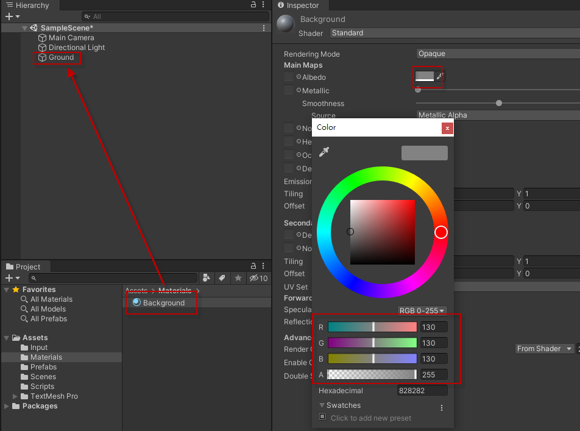
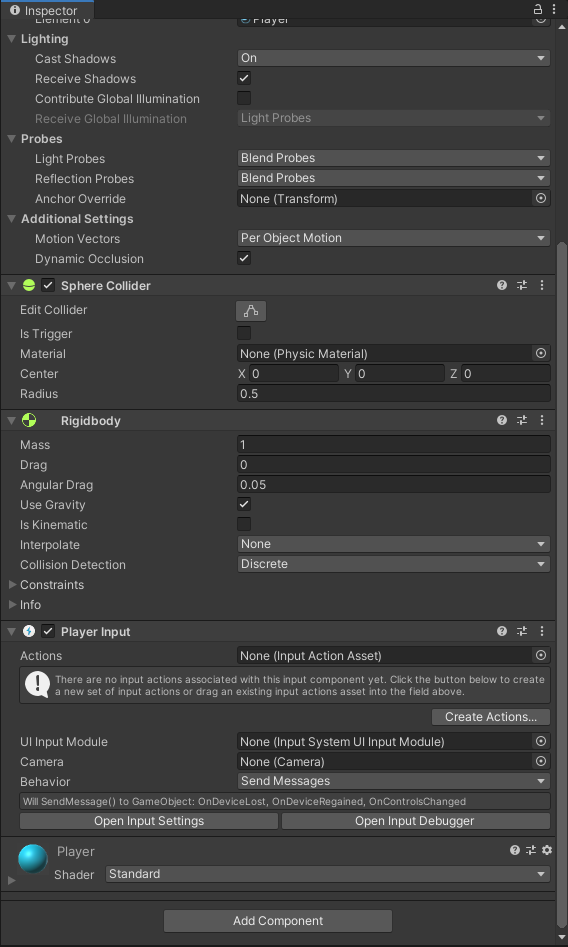
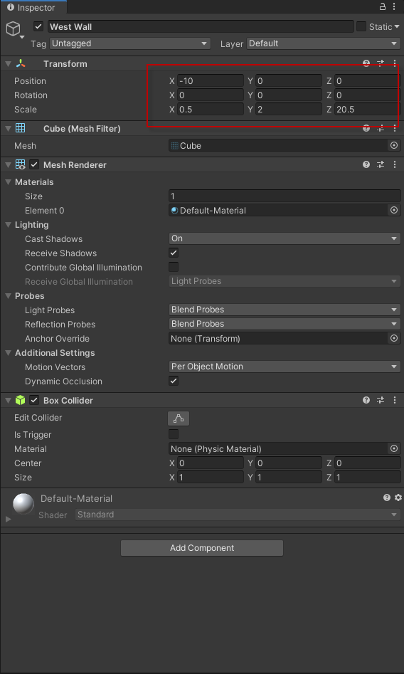
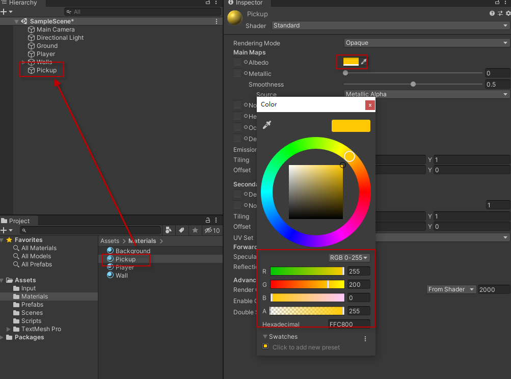

# tutorial-roll-a-ball


Unity官方範例 https://learn.unity.com/project/roll-a-ball
# 創建專案


在Hierarchy視窗點擊滑鼠右鍵，創建一個Plane到場景上


同理創建一個Sphere，並改名為Player




創造材質球賦予物件色彩
# 移動Player


匯入Input System套件，用來讀取玩家輸入訊號


按下會重啟Unity，並套用新的Input System



在Player身上新增PlayerInput組件


創建CSharp腳本名稱為PlayerController用來控制Player相關行為


#### PlayerController.cs
```diff
using System.Collections;
using System.Collections.Generic;
using UnityEngine;
+using UnityEngine.InputSystem;

public class PlayerController : MonoBehaviour
{
    // Start is called before the first frame update
    void Start()
    {
        
    }

+   void OnMove(InputValue movementValue)
+   {
+   
+   }

    void Update()
    {
        
    }
}
```

```diff
using System.Collections;
using System.Collections.Generic;
using UnityEngine;
using UnityEngine.InputSystem;

public class PlayerController : MonoBehaviour
{
+   private Rigidbody rb;
    // Start is called before the first frame update
    void Start()
    {
+        rb = GetComponent<Rigidbody>();//抓取物件身上的RigidBody Component記憶體位置並存放在rb變數中
    }

    void OnMove(InputValue movementValue)
    {
+        Vector2 movementVector = movementValue.Get<Vector2>();
    }

+    void FixedUpdate()
+    {
+     
+    }
}
```

```diff
using System.Collections;
using System.Collections.Generic;
using UnityEngine;
using UnityEngine.InputSystem;

public class PlayerController : MonoBehaviour
{
    private Rigidbody rb;
+   private float movementX;
+   private float movementY;
    // Start is called before the first frame update
    void Start()
    {
        rb = GetComponent<Rigidbody>();//抓取物件身上的RigidBody Component記憶體位置並存放在rb變數中
    }

    void OnMove(InputValue movementValue)
    {
        Vector2 movementVector = movementValue.Get<Vector2>();
+       movementX = movementVector.x;
+       movementY = movementVector.y;
    }

    void FixedUpdate()
    {
+       Vector3 movement = new Vector3(movementX, 0, movementY);
+       rb.AddForce(movement);
    }
}
```

```diff
using System.Collections;
using System.Collections.Generic;
using UnityEngine;
using UnityEngine.InputSystem;

public class PlayerController : MonoBehaviour
{
+   public float speed = 0;

    private Rigidbody rb;
    private float movementX;
    private float movementY;
    // Start is called before the first frame update
    void Start()
    {
        rb = GetComponent<Rigidbody>();//抓取物件身上的RigidBody Component記憶體位置並存放在rb變數中
    }

    void OnMove(InputValue movementValue)
    {
        Vector2 movementVector = movementValue.Get<Vector2>();
        movementX = movementVector.x;
        movementY = movementVector.y;
    }

    void FixedUpdate()
    {
        Vector3 movement = new Vector3(movementX, 0, movementY);
+       rb.AddForce(movement * speed);
    }
}
```


設定移動速度為10

```csharp
using System.Collections;
using System.Collections.Generic;
using UnityEngine;
using UnityEngine.InputSystem;//宣告引用 為了可以使用InputSystem相關功能

public class PlayerController : MonoBehaviour
{
    public float speed = 0;//宣告(Declare)一個類型為Float的公開變數，可透過檢視器(Inspector)修改移動速度

    private Rigidbody rb;//宣告私有變數，用來關聯(Reference)RigidBody Component的記憶體位置(Address)
    private float movementX;//宣告私有變數，用來存放玩家輸入的X方向值
    private float movementY;//宣告私有變數，用來存放玩家輸入的Y方向值

    //物件被生成時會自動被系統呼叫一次
    void Start()
    {
        rb = GetComponent<Rigidbody>();//抓取自身物件上的RigidBody Component的記憶體位置(Address)並關聯(Reference)在rb變數中
    }

    //實作(Implement)InputSystem要呼叫的方法(Method)，InputValue為InputSystem呼叫時會傳入的參數型態
    void OnMove(InputValue movementValue)
    {
        Vector2 movementVector = movementValue.Get<Vector2>();//InputValue參數類別(Class)提供Get方法去讀取當前玩家X Y方向的輸入值
        movementX = movementVector.x;//從二維向量本地變數讀取X軸方向，並存入movementX變數中
        movementY = movementVector.y;//從二維向量本地變數讀取Y軸方向，並存入movementY變數中
    }

    //物理運算之前會被系統自動呼叫，所有物理相關的操作都要寫在這個方法(Method)裡面
    void FixedUpdate()
    {
        Vector3 movement = new Vector3(movementX, 0, movementY);//宣告一個三維向量的本地變數，並把先前紀錄的movementX和movementY傳入進去
        rb.AddForce(movement * speed);//透過rb變數去呼叫身上的RigidBody Component，透過AddForce方法施加一個方向的力讓物體移動，透過乘上speed變數控制施加力的大小
    }
}
```
# 移動攝影機(Camera)
#### CameraController.cs


```diff
using System.Collections;
using System.Collections.Generic;
using UnityEngine;

public class CameraController : MonoBehaviour
{
+   public GameObject player;
+   private Vector3 offset;

    // Start is called before the first frame update
    void Start()
    {
+       offset = transform.position - player.transform.position;
    }

    // Update is called once per frame
-   void Update()
+   void LateUpdate()
    {
+       transform.position = player.transform.position + offset;
    }
}
```

```csharp
using System.Collections;
using System.Collections.Generic;
using UnityEngine;

public class CameraController : MonoBehaviour
{
    public GameObject player;//透過Inspector指定Player物件
    private Vector3 offset;//紀錄初始的位移差

    // Start is called before the first frame update
    void Start()
    {
        offset = transform.position - player.transform.position;//計算當前攝影機與Player物件的位移差，並存放到offset變數中
    }

    //在每次Update之後執行，可確保在所有Update中改變位置之後，再移動攝影機位置
    void LateUpdate()
    {
        transform.position = player.transform.position + offset;//讓攝影機與玩家永遠保持一樣的位移差，製造出追隨的效果
    }
}
```
# 設置遊戲場景


將West Wall拖曳至Walls底下成為其子物件




複製3個出來(可透過Ctrl+D)，並分別命名為East Wall、North Wall、South Wall


# 創建拾取物件


創建一個方塊(Cube)，並命名為Pickup



#### Rotator.cs
```diff
using System.Collections;
using System.Collections.Generic;
using UnityEngine;

public class Rotator : MonoBehaviour
{
    // Start is called before the first frame update
    void Start()
    {
        
    }

    // Update is called once per frame
    void Update()
    {
+       transform.Rotate(new Vector3(15, 30, 45) * Time.deltaTime);
    }
}
```

```csharp
using System.Collections;
using System.Collections.Generic;
using UnityEngine;

public class Rotator : MonoBehaviour
{
    // Start is called before the first frame update
    void Start()
    {
        
    }

    //每一次幀(Frame)都會被呼叫一次
    void Update()
    {
        transform.Rotate(new Vector3(15, 30, 45) * Time.deltaTime);//對自己身上的Transform Component呼叫旋轉方法，透過Time.deltaTime去弭平不同幀率上表現誤差
    }
}
```


從Hierarchy視窗拖曳Pickup物件至Project視窗可自動產生prefab


在Project視窗雙擊Pickup Prefab能進入Prefab編輯模式


設定Pickup物件的Tag，方便讓程式判斷


設定Pickup物件的Trigger，讓OnTriggerEnter能被觸發

#### PlayerController.cs
```diff
using System.Collections;
using System.Collections.Generic;
using UnityEngine;
using UnityEngine.InputSystem;

public class PlayerController : MonoBehaviour
{
    public float speed = 0;

    private Rigidbody rb;
    private float movementX;
    private float movementY;
    // Start is called before the first frame update
    void Start()
    {
        rb = GetComponent<Rigidbody>();
    }

    void OnMove(InputValue movementValue)
    {
        Vector2 movementVector = movementValue.Get<Vector2>();
        movementX = movementVector.x;
        movementY = movementVector.y;
    }

    void FixedUpdate()
    {
        Vector3 movement = new Vector3(movementX, 0, movementY);
        rb.AddForce(movement * speed);
    }
    
+   private void OnTriggerEnter(Collider other)
+   {
+       if (other.gameObject.CompareTag("Pickup"))
+       {
+           other.gameObject.SetActive(false);
+       }
+   }
}
```

# 顯示分數和勝利訊息


需要匯入TMP基礎素材


#### PlayerController.cs
```diff
using System.Collections;
using System.Collections.Generic;
using UnityEngine;
using UnityEngine.InputSystem;

public class PlayerController : MonoBehaviour
{
    public float speed = 0;

    private Rigidbody rb;
+   private int count;
    private float movementX;
    private float movementY;
    // Start is called before the first frame update
    void Start()
    {
        rb = GetComponent<Rigidbody>();//抓取物件身上的RigidBody Component記憶體位置並存放在rb變數中
    }

    void OnMove(InputValue movementValue)
    {
        Vector2 movementVector = movementValue.Get<Vector2>();
        movementX = movementVector.x;
        movementY = movementVector.y;
    }

    void FixedUpdate()
    {
        Vector3 movement = new Vector3(movementX, 0, movementY);
        rb.AddForce(movement * speed);
    }
    
    private void OnTriggerEnter(Collider other)
    {
        if (other.gameObject.CompareTag("Pickup"))
        {
            other.gameObject.SetActive(false);
+           count = count + 1;//count++
        }
    }
}
```
```diff
using System.Collections;
using System.Collections.Generic;
using UnityEngine;
using UnityEngine.InputSystem;
+using TMPro;

public class PlayerController : MonoBehaviour
{
    public float speed = 0;
    public TextMeshProUGUI countText;
    
    private Rigidbody rb;
    private int count;
    private float movementX;
    private float movementY;
    // Start is called before the first frame update
    void Start()
    {
        rb = GetComponent<Rigidbody>();//抓取物件身上的RigidBody Component記憶體位置並存放在rb變數中
+       SetCountText();
    }

    void OnMove(InputValue movementValue)
    {
        Vector2 movementVector = movementValue.Get<Vector2>();
        movementX = movementVector.x;
        movementY = movementVector.y;
    }

+   void SetCountText()
+   {
+       countText.text = "Count: " + count.ToString();
+   }
    
    void FixedUpdate()
    {
        Vector3 movement = new Vector3(movementX, 0, movementY);
        rb.AddForce(movement * speed);
    }
    
    private void OnTriggerEnter(Collider other)
    {
        if (other.gameObject.CompareTag("Pickup"))
        {
            other.gameObject.SetActive(false);
            count = count + 1;//count++
+           SetCountText();
        }
    }
}
```


因為使用新的Input System故需要手動替換EventSystem預設的Input Module


```diff
using System.Collections;
using System.Collections.Generic;
using UnityEngine;
using UnityEngine.InputSystem;
using TMPro;

public class PlayerController : MonoBehaviour
{
    public float speed = 0;
    public TextMeshProUGUI countText;
+   public GameObject winTextObject;
    
    private Rigidbody rb;
    private int count;
    private float movementX;
    private float movementY;
    // Start is called before the first frame update
    void Start()
    {
        rb = GetComponent<Rigidbody>();//抓取物件身上的RigidBody Component記憶體位置並存放在rb變數中
        SetCountText();
+       winTextObject.SetActive(false);
    }

    void OnMove(InputValue movementValue)
    {
        Vector2 movementVector = movementValue.Get<Vector2>();
        movementX = movementVector.x;
        movementY = movementVector.y;
    }

    void SetCountText()
    {
        countText.text = "Count: " + count.ToString();
+       if(count >= 12)
+       {
+           winTextObject.SetActive(true);
+       }
    }
    
    void FixedUpdate()
    {
        Vector3 movement = new Vector3(movementX, 0, movementY);
        rb.AddForce(movement * speed);
    }
    
    private void OnTriggerEnter(Collider other)
    {
        if (other.gameObject.CompareTag("Pickup"))
        {
            other.gameObject.SetActive(false);
            count = count + 1;//count++
            SetCountText();
        }
    }
}
```

```csharp
using System.Collections;
using System.Collections.Generic;
using UnityEngine;
using UnityEngine.InputSystem;//宣告引用，為了可以使用InputSystem相關功能
using TMPro;//引用TextMeshPro這個套件相關功能

public class PlayerController : MonoBehaviour
{
    public float speed = 0;//宣告(Declare)一個類型為Float的公開變數，可透過檢視器(Inspector)修改移動速度
    public TextMeshProUGUI countText;//宣告一個類型為TextMeshProUGUI的公開變數，可透過檢視器指定要關聯的物件
    public GameObject winTextObject;//宣告一個類型為GameObject的公開變數，可透過檢視器指定要關聯的物件

    private Rigidbody rb;//宣告私有變數，用來關聯(Reference)RigidBody Component的記憶體位置(Address)
    private int count;//宣告一個類型為Int的變數，用來紀錄當前碰到的Pickup數量
    private float movementX;//宣告私有變數，用來存放玩家輸入的X方向值
    private float movementY;//宣告私有變數，用來存放玩家輸入的Y方向值

    //物件被生成時會自動被系統呼叫一次
    void Start()
    {
        rb = GetComponent<Rigidbody>();//抓取自身物件上的RigidBody Component的記憶體位置(Address)並關聯(Reference)在rb變數中
        SetCountText();//呼叫該方法
        winTextObject.SetActive(false);//關閉該物件
    }

    //實作(Implement)InputSystem要呼叫的方法(Method)，InputValue為InputSystem呼叫時會傳入的參數型態
    void OnMove(InputValue movementValue)
    {
        Vector2 movementVector = movementValue.Get<Vector2>();//InputValue參數類別(Class)提供Get方法去讀取當前玩家X Y方向的輸入值
        movementX = movementVector.x;//從二維向量本地變數讀取X軸方向，並存入movementX變數中
        movementY = movementVector.y;//從二維向量本地變數讀取Y軸方向，並存入movementY變數中
    }

    //將當前Count值，更新至UI上
    void SetCountText()
    {
        countText.text = "Count: " + count.ToString();//傳入新的字串給UI顯示
        if(count >= 12)//如果當前累計數量超過12以上，則開啟勝利文字物件
        {
            winTextObject.SetActive(true);//開啟勝利文字物件
        }
    }

    //物理運算之前會被系統自動呼叫，所有物理相關的操作都要寫在這個方法(Method)裡面
    void FixedUpdate()
    {
        Vector3 movement = new Vector3(movementX, 0, movementY);//宣告一個三維向量的本地變數，並把先前紀錄的movementX和movementY傳入進去
        rb.AddForce(movement * speed);//透過rb變數去呼叫身上的RigidBody Component，透過AddForce方法施加一個方向的力讓物體移動，透過乘上speed變數控制施加力的大小
    }

    //當其他觸發器(Trigger)碰到此物件，開方法會被呼叫，並傳入碰到的物件Collider
    private void OnTriggerEnter(Collider other)
    {
        if (other.gameObject.CompareTag("Pickup"))//如果碰到的Collider遊戲物件Tag為Pickup才做判斷
        {
            other.gameObject.SetActive(false);//關閉碰到的物件
            count = count + 1;//count++; 增加計次
            SetCountText();//更新Count UI文字
        }
    }
}
```
# 輸出成執行檔


把要輸入的場景(Scene)加入倒Build Settings


預設為全螢幕模式，這次我們手動改為視窗模式


